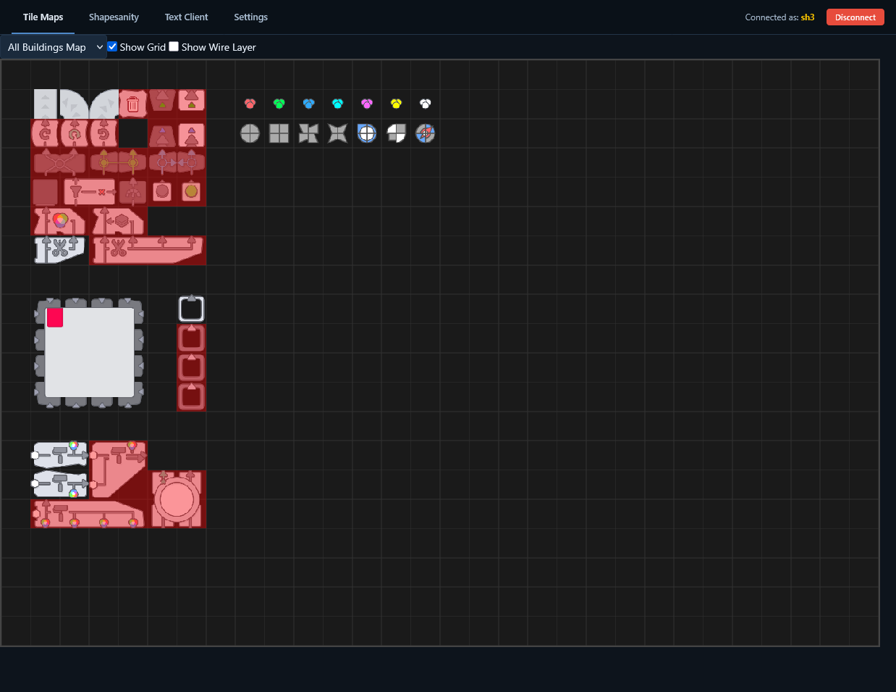
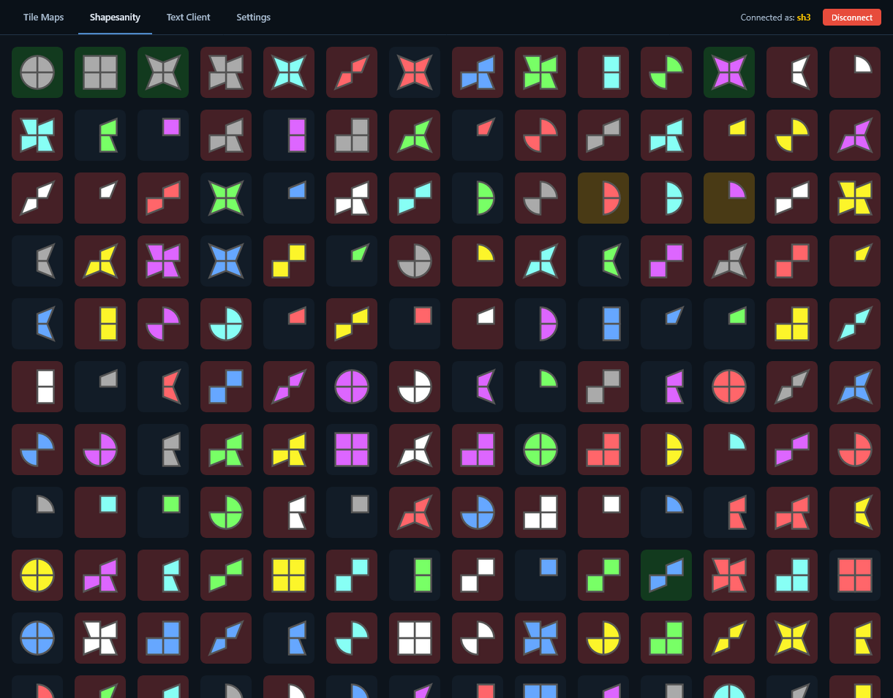
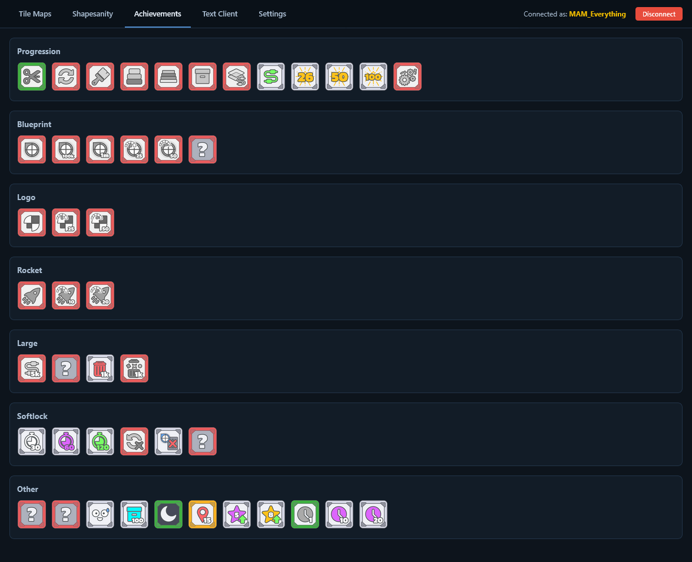
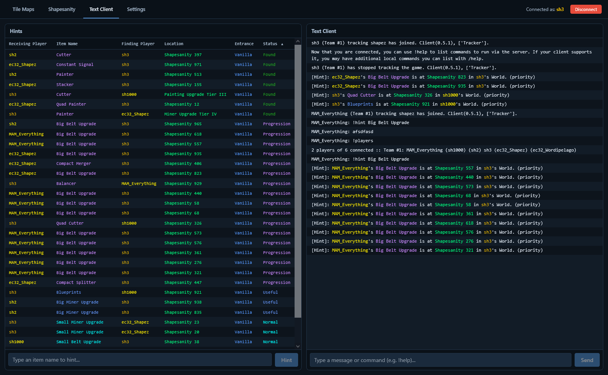
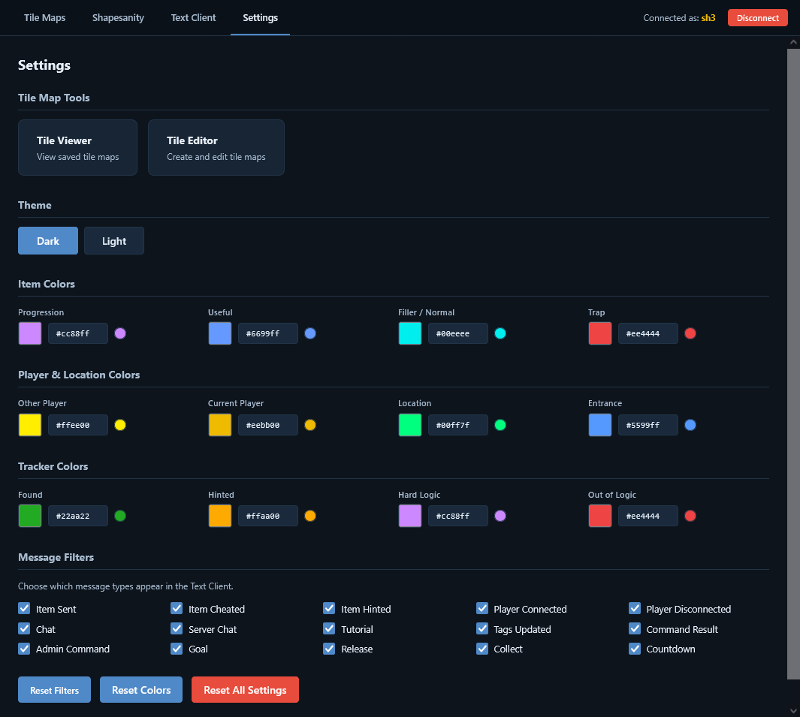

# Shapez AP Tracker
> Currently hosted at https://shapezap.ec32.tech

This is a tracker for shapez Archipelago Multiworld. It has:
- **Tile Maps** (or **Factory Templates**) Tracker. You can create your own factory template and see, if buildings used in it available or not.
- **Shapesanity Tracker** to show you your shapesanity *in a grid* and if it is in/out of logic, hinted or completed.
- **Achievements Tracker** and if it is in/out of logic or completed. 
- **Text Client** with **Hints**
- **Settings** page, where you can manage Tile Maps, change theme, change colors used in tracker and filter messages in Text Client by type.

## Notes
- ⚠ If you find logic bugs, please go to https://shapezap.ec32.tech/?debug and send me screenshot from there
- Currently some achievements do not have logic, therefore always shown as in logic. Specifically: 
  - Wires
  - Freedom
  - Can't Stop
  - Is this the end?
  - Faster
  - Even Faster
  - Speedrun Master
  - Speedrun Novice
  - Not an idle game
  - It's so slow.
- While `Hub` and `Logic Gates (NOT)` always sends `TRUE` signal, world logic doesn't use it. Therefore not used in logic.

## Screenshots

## Usage
1. Go to https://shapezap.ec32.tech
2. Enter your server address and port, slotname, password.
3. (optional) Go to `Settings` and change them for your comfort

## Development
1. `git clone https://github.com/Eclassic32/ShapezAPTracker`
2. `cd ShapezAPTracker`
3. `npm i`
4. `npm run dev`

## Credits
- [Archipelago](https://github.com/ArchipelagoMW/Archipelago) by ArchipelagoMW
- [archipelago.js](https://archipelago.js.org) by ThePhar
- [shapez](https://store.steampowered.com/app/1318690/shapez/) by topspr
- [shapez AP World](https://github.com/BlastSlimey/shapezipelago) by BlastSlimey
